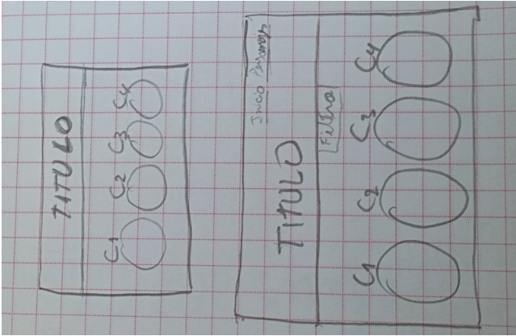

# Proyecto Harry Potter

Este es un proyecto web dedicado al mundo mágico de Harry Potter. El cual proporciona información sobre las casas de Hogwarts, personajes, hechizos, libros y películas.

## Contenido

- [Información](#)
- [Personajes](personajes.html)
- [Casas](casas.html)
- [Hechizos](hechizos.html)
- [Libros](libros.html)
- [Películas](peliculas.html)

## Estructura del Proyecto

- **index.html:** Página principal del proyecto.
- **personajes.html:** Información sobre los personajes.
- **casas.html:** Información detallada sobre las casas de Hogwarts.
- **hechizos.html:** Lista de hechizos mágicos.
- **libros.html:** Detalles sobre los libros de Harry Potter.
- **peliculas.html:** Información sobre las películas.

## Uso

1. Clona este repositorio.
2. Abre el archivo `index.html` en tu navegador.

## prototipo inicial

Al inicio lo diseñamos asi [canva](https://www.canva.com/design/DAF4eXU5izw/2Ja9btE5GdHvHHlMS8P56Q/view?utm_content=DAF4eXU5izw&utm_campaign=designshare&utm_medium=link&utm_source=editor)

## Estilos Personalizados

Los estilos del proyecto se encuentran en el archivo `styles.css`. Puedes personalizarlos según tus preferencias.

## JavaScript

El archivo `inicio.js` contiene scripts adicionales para la funcionalidad del menú.
## JSON
Tenemos un archivo `JSON` que contiene la informacion que usamos en los archivos `js`

## Imágenes

Las imágenes del proyecto se encuentran en la carpeta `img`.

----

¡Espero que disfrutes explorando el mundo mágico de Harry Potter en este proyecto!